# How to use Lyrebird

This guide covers everything from first launch to a finished dialogue.
For what each option does in detail, see [Options in the README](README.md#options).

- [1. First launch: one-time setup](#1-first-launch-one-time-setup)
- [2. The main window](#2-the-main-window)
- [3. Add a voice](#3-add-a-voice)
- [4. Choose a source](#4-choose-a-source)
- [5. Type what to say](#5-type-what-to-say)
- [6. Write a dialogue with several voices](#6-write-a-dialogue-with-several-voices)
- [7. Add laughs, sighs and other sounds (Turbo)](#7-add-laughs-sighs-and-other-sounds-turbo)
- [8. Render](#8-render)
- [Troubleshooting](#troubleshooting)

---

## 1. First launch: one-time setup

Unzip `Lyrebird-win64.zip` anywhere and run `Lyrebird\Lyrebird.exe`.

The download is small (about 33 MB) because the voice engine isn't included. On the first launch, Lyrebird downloads Python, PyTorch and Chatterbox into `%LOCALAPPDATA%\Lyrebird`:

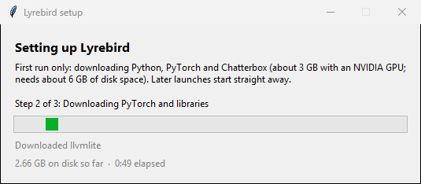

- **The step line** says what is happening: Python (step 1), PyTorch and libraries (step 2, the big one), then Chatterbox (step 3).
- **The grey line under the bar** is the installer's latest message.
- **The bottom line** shows how much is on disk so far and how long it has taken. Packages are unpacked as they arrive, so this number ends up about twice the download size.

Expect about a 3 GB download with an NVIDIA GPU, or much less without one. Setup needs about 6 GB of free disk space. Lyrebird picks the right PyTorch build for your PC automatically. On a fast connection it takes a couple of minutes. When it's done, the main window opens by itself. Later launches skip this step.

If you close the window or lose your connection, start Lyrebird again. Setup picks up where it stopped.

> **Windows SmartScreen:** the exe isn't code-signed yet, so Windows may show "Windows protected your PC". Click **More info → Run anyway**.

## 2. The main window

Lyrebird opens with a splash screen showing its version while it finds your voices and audio devices:

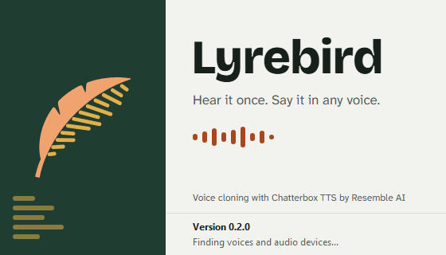

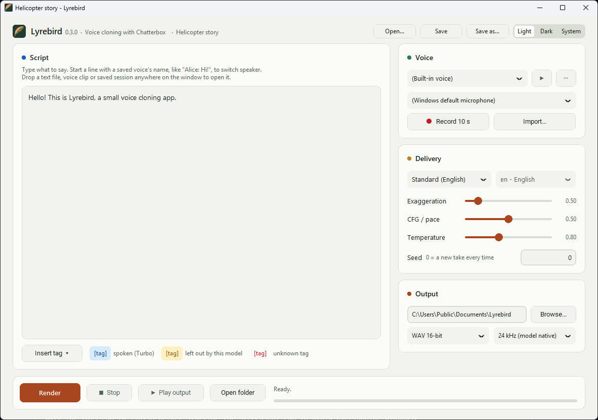

The window is laid out top to bottom in the order you use it:

1. **Voice**: who should speak, and the tools to record or import new voices.
2. **Text to speak**: what they should say.
3. **Options**: which model to use and how expressive it should be.
4. **Render**: where the file goes, the Render button, and progress.

Just want to hear it work? Type a sentence and click **Render**. The model's built-in voice is used.

## 3. Add a voice

Lyrebird clones a voice from a short sample. Voices are saved by name in `Documents\Lyrebird\voices` and stay in the **Voice** list for next time:

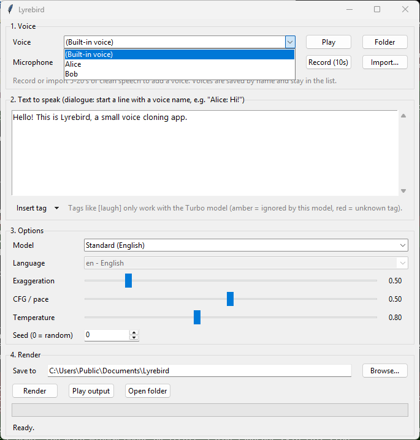

There are two ways to add a voice:

- **Record (10s):** click it, give the voice a name, then talk for 10 seconds. The status line counts down.
- **Import...:** pick a `.wav`, `.mp3`, `.flac` or `.ogg` file, then give it a name.

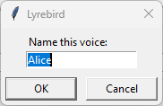

Next, the **Trim** window shows the recording as a waveform:

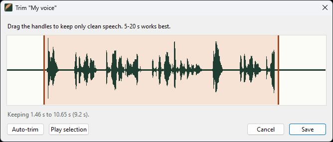

- The highlighted part is what gets saved. Lyrebird starts with the speech already selected and the silence at each end cut off.
- **Drag** in the waveform to move the nearest handle, the start or the end.
- **Play selection** plays just the highlighted part. **Auto-trim** goes back to the automatic selection.
- The line under the waveform shows the length. It turns amber below 5 seconds (too short for Turbo) and above 20 seconds (longer than it needs to be).
- **Save** stores the voice. **Cancel** throws the take away.

With a long file, such as a whole podcast episode, Lyrebird selects the first 15 seconds of speech. Drag the handles to the part you want.

The new voice is selected automatically. **Play** plays the selected voice's sample. It's greyed out while **(Built-in voice)** is selected, because there's no sample to play.

### Manage voices

The **Manage** menu next to **Play** works on the selected voice:

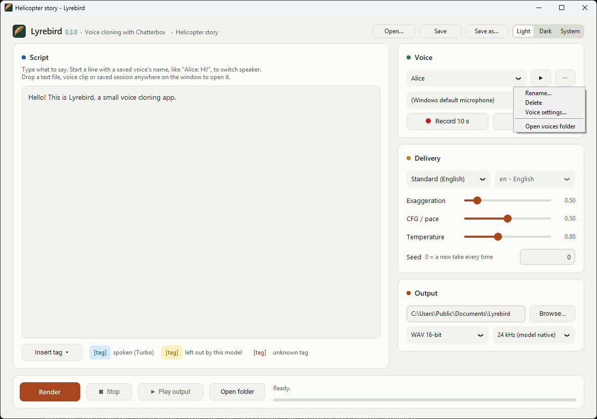

- **Rename...** gives the voice a new name. Update any dialogue lines that used the old name.
- **Delete** removes the voice and its sample file, after asking first.
- **Voice settings...** gives this voice its own exaggeration, CFG/pace or temperature (see below).
- **Open voices folder** opens `Documents\Lyrebird\voices` in Explorer.

### Give a voice its own settings

In **Voice settings**, tick a setting to give the voice its own value. Unticked settings follow the main sliders.

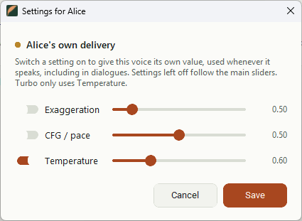

A voice's own settings apply whenever it speaks, including in dialogues, so a calm narrator and an excitable character can share one script. They're saved next to the sample as `<name>.json`, and they follow the voice when you rename it. Turbo only uses **Temperature**, because it ignores the other two.

**For a good clone:**

- Use 5 to 20 seconds of one person talking naturally.
- Avoid music, background noise, other voices and echoey rooms.
- When recording, start talking right away and keep going until the countdown ends.
- The Turbo model needs a sample longer than 5 seconds.

Only clone voices you have permission to use. See [Responsible use](README.md#responsible-use).

## 4. Choose a source

The **Source** list shows what **Record (10s)** records from:

- **Microphones:** every input device Windows knows about. **(Windows default microphone)** uses whatever is set as default in Windows Sound settings.
- **What you hear:** one entry per output device, such as your speakers or headphones. It records whatever the PC is playing on that device, so you can capture a voice from a video or call. Start the audio playing, then click **Record (10s)**. Your default output is listed first.

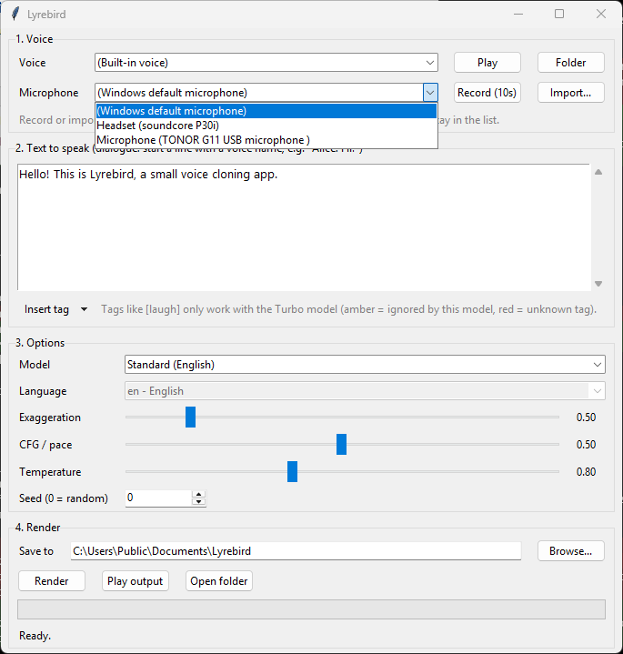

If you plug in a device while Lyrebird is open, it appears the next time you open the list. A recording that comes out silent isn't saved: Lyrebird tells you instead. With "What you hear", that usually means nothing was playing on that output.

## 5. Type what to say

Type or paste any amount of text into **Text to speak**. Long text is split at sentence ends and line breaks into short chunks, and the chunks are joined with a short pause, so a whole article works.

To speak in another language, choose **Multilingual (23 languages)** as the model and pick the **Language** of your text.

## 6. Write a dialogue with several voices

Start a line with a saved voice's name and a colon to switch speaker:

```
Alice: Did you hear? Lyrebird can do dialogue now. [laugh]
Bob: [sigh] Of course it can. What's next, singing?
Alice: Only if you ask nicely.
Built-in: And so the two voices argued late into the night.
```

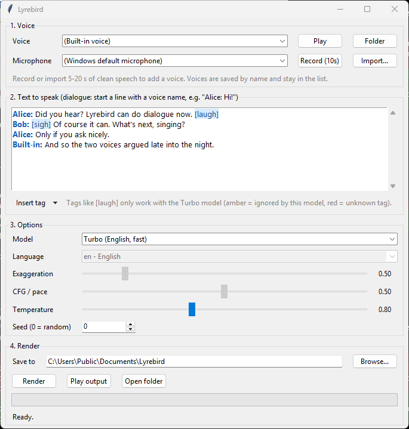

- Names that Lyrebird recognises turn **bold blue**, so you can see the script is understood.
- Names match your voice list, ignoring capitals. `Built-in:` uses the model's own voice.
- A name that isn't a saved voice is read out as normal text. That way, lines like `Note: remember the milk` are safe.
- Lines without a name continue with the current speaker.
- Text before the first name uses the voice selected in the **Voice** list.
- Each voice is analysed once per render, so long dialogues don't slow down with every speaker change.

**A longer example:** [examples/juan-and-the-helicopter.txt](examples/juan-and-the-helicopter.txt) is a 17-line story that uses speaker switching and six sound tags. To render it:

1. Save a voice named `Narrator`.
2. Select the **Turbo** model.
3. Paste in the script and click **Render**.

## 7. Add laughs, sighs and other sounds (Turbo)

With the **Turbo (English, fast)** model, you can put sound tags in the text, like `[laugh]`, `[sigh]` or `[whispering]`. Use **Insert tag** to add one at the cursor:

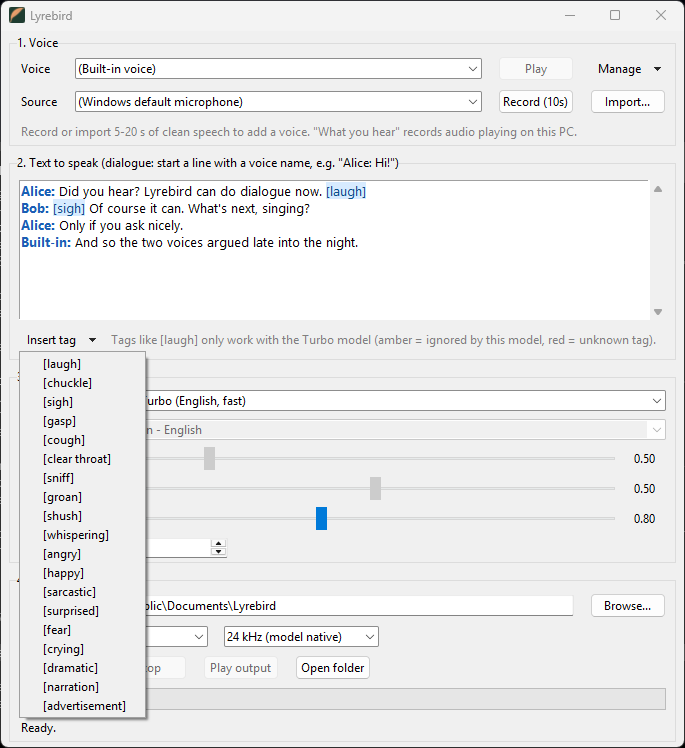

Tags are coloured as you type:

| Colour | Meaning |
|---|---|
| Blue | A tag Turbo understands. |
| Amber | A real tag, but only Turbo supports tags. With the selected model, Lyrebird leaves it out when rendering, so it isn't read aloud. |
| Red underline | Not a known tag. Check the spelling: `[laughs]` should be `[laugh]`. |

Here is the same script with the **Standard** model selected, so the tags turn amber:

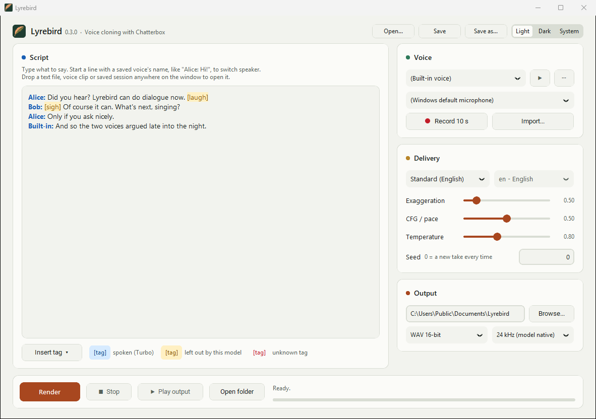

All 19 tags: `[laugh]` `[chuckle]` `[sigh]` `[gasp]` `[cough]` `[clear throat]` `[sniff]` `[groan]` `[shush]` `[whispering]` `[angry]` `[happy]` `[sarcastic]` `[surprised]` `[fear]` `[crying]` `[dramatic]` `[narration]` `[advertisement]`

## 8. Render

Before rendering, pick a **Format** and **Sample rate** under **Save to**:

- **WAV 16-bit** is the default and plays anywhere.
- **WAV 32-bit float** and **FLAC 24-bit** suit a DAW or sample library. FLAC files are smaller.
- **44.1 kHz** and **48 kHz** resample the model's 24 kHz output to match your project, so you don't have to convert it later.

Click **Render**. The progress bar moves, and the status line says what's happening:


- **Downloading … GB so far** appears only the first time you use each model. Each model is a one-time 3 to 4 GB download.
- **Analysing voice …** means Lyrebird is reading a voice sample.
- **Rendering chunk 2/4 (Bob)** shows which part is being spoken and by whom.
- **Stop** cancels the render after the chunk that's in progress. Nothing is saved.

When it finishes, the status line shows where the file was saved:

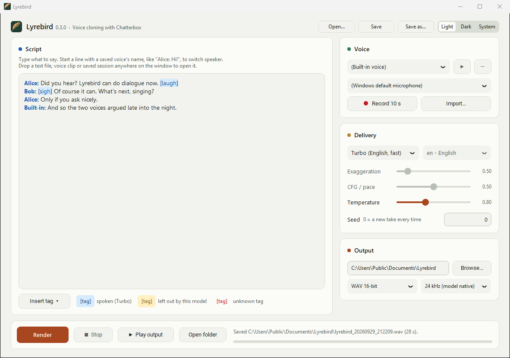

Then:

- **Play output** plays the result. 16-bit WAV plays inside Lyrebird; float WAV and FLAC open in your default player.
- **Open folder** opens the output folder in Explorer.
- Every render gets its own file, `lyrebird_<date>_<time>.wav` (or `.flac`), so nothing is overwritten.

Lyrebird remembers your model, language, sliders, seed, output folder, format, voice, source and window size, and restores them the next time it opens.

**If a take sounds off**, click Render again for a new variation, or try these:

- Lower **Temperature** for steadier speech.
- Raise **Exaggeration** for more drama. It works with Standard and Multilingual.
- Lower **CFG / pace** for slower delivery.
- Set a **Seed** other than 0 to make a take you like repeatable.

## Troubleshooting

| Problem | What to do |
|---|---|
| Setup failed | Check your internet connection and start Lyrebird again. Setup resumes. The details are in `%LOCALAPPDATA%\Lyrebird\setup.log`. |
| "Lyrebird failed to start" | See `%LOCALAPPDATA%\Lyrebird\lyrebird.log`. To force a fresh setup, delete `%LOCALAPPDATA%\Lyrebird\env`. |
| Rendering is very slow | The status line says `on CPU` when the model loads: no usable NVIDIA GPU was found. Updating the NVIDIA driver and deleting `%LOCALAPPDATA%\Lyrebird\env` makes setup pick the GPU build. |
| "Couldn't open … Another app may be using it exclusively" | Close apps that might hold the mic (voice chat, games, recording software), or turn off Windows' "Allow applications to take exclusive control of this device" in the mic's Sound Control Panel properties (Advanced tab). |
| A microphone is missing | Open the **Source** list again to rescan. Check that Windows lists the mic under Settings → System → Sound → Input. |
| "The recording ... is silent" | For a microphone: choose the right one, and check Windows' microphone privacy setting: Settings → Privacy & security → Microphone → "Let desktop apps access your microphone". For **What you hear**: make sure audio is playing on that output device while you record. |
| "Audio prompt must be longer than 5 seconds" | Turbo needs a longer sample. Record again, or import a longer clip. |
| A voice sounds wrong in dialogue | Make sure the name before the colon turned bold blue. If it didn't, it doesn't match a saved voice exactly. |
| Anything else | Please open an issue and attach `%LOCALAPPDATA%\Lyrebird\lyrebird.log`. |
