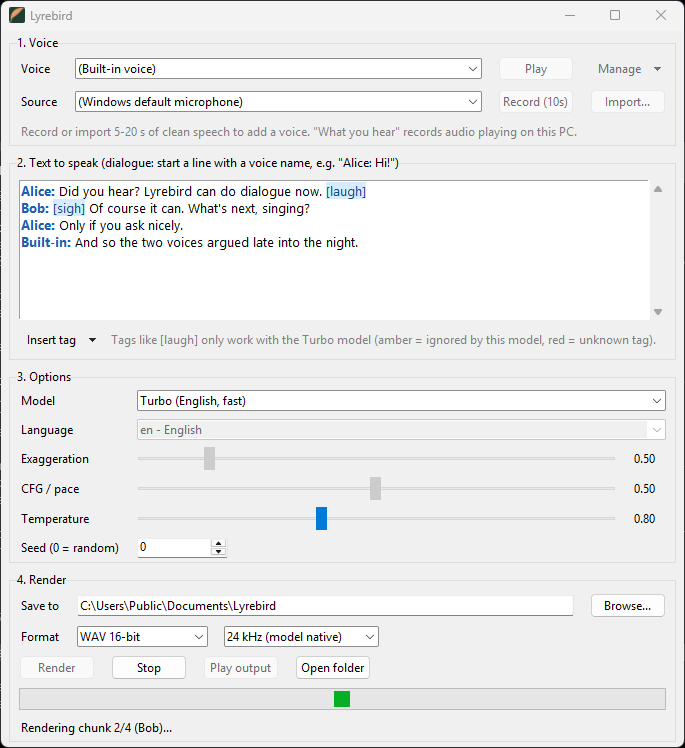

# Lyrebird

[](https://github.com/zebadrabbit/Lyrebird/actions/workflows/ci.yml)

A small Windows desktop app for voice cloning with [Chatterbox TTS](https://github.com/resemble-ai/chatterbox) by Resemble AI.

1. **Record (10s)** of your voice, or **Import** a clip of someone who has agreed to be cloned.
2. Type some text. It can be a dialogue between several saved voices, with `[laugh]`-style sound tags.
3. Click **Render**. You get a `.wav` file.



Everything runs locally on your PC. **Step-by-step guide with screenshots: [HOWTO.md](HOWTO.md).**

> The name comes from the lyrebird, an Australian bird that can copy almost any sound it hears.

---

## Quick start

1. Download `Lyrebird-win64.zip` (about 33 MB) from the [Releases page](https://github.com/zebadrabbit/Lyrebird/releases) and unzip it anywhere.
2. Run `Lyrebird\Lyrebird.exe`. The exe isn't code-signed yet, so if Windows SmartScreen appears, click **More info → Run anyway**.
3. **First launch only:** a setup window downloads Python, PyTorch and Chatterbox into `%LOCALAPPDATA%\Lyrebird`. That's about a 3 GB download with an NVIDIA GPU, and much less without one. It needs about 6 GB of free disk space once unpacked. The window shows the current step, how much is on disk so far and how long it has taken. Setup took under 2 minutes on a fast connection. Later launches start straight away.
4. **First render with each model:** Lyrebird downloads that model, roughly 3 to 4 GB, to your Hugging Face cache. The status line shows the progress.

**Requirements:** 64-bit Windows 10 or 11 and an internet connection for the first run. An NVIDIA GPU is strongly recommended: about 6 GB of VRAM, since the models use 3 to 4 GB while rendering. Setup picks the PyTorch build that matches your NVIDIA driver. Without an NVIDIA GPU, Lyrebird installs the CPU build and runs on the CPU. That works, but slowly: expect tens of seconds or more per sentence.

## Features

- **Voice library:** record 10 s from any microphone or import wav/mp3/flac/ogg, give it a name, and it stays in the **Voice** list. Voices are stored in `Documents\Lyrebird\voices`.
- **Microphone picker:** lists every input device. Newly plugged-in mics show up the next time you open the list.
- **Multi-speaker dialogue:** start a line with a saved voice's name to switch speaker:
  ```
  Alice: Did you hear the news?
  Bob: No, what happened?
  Built-in: I'm the narrator.
  ```
  A line only switches speaker when the name matches a saved voice (ignoring capitals). `Built-in` is the model's own voice. Lines without a name continue with the current speaker, and text before the first name uses the voice selected in the **Voice** list.
- **Sound tags (Turbo model):** type or insert tags such as `[laugh]`, `[sigh]` and `[whispering]`. They're highlighted blue when the selected model supports them. With other models they turn amber and are left out when rendering, so they aren't read aloud. Unknown tags are underlined in red.
- **Three models:** Standard (English), Turbo (English, fast) and Multilingual (23 languages).
- **Any length of text:** text is split at sentence ends and line breaks into chunks of up to 300 characters (100 for Chinese, Japanese and Korean). The chunks are rendered one by one and joined with a 0.2 s gap. Splitting is needed because the models stop at about 40 s of audio per chunk.

## Options

| Option | Range (default) | Models | Effect |
|---|---|---|---|
| **Voice** | saved voices or (Built-in voice) | all | Who speaks. It's also the speaker for any text before the first `Name:` line. |
| **Microphone** | input devices (Windows default) | all | Used by **Record (10s)**. Records at the device's own sample rate; if the device has several channels, the loudest one is kept. |
| **Model** | Standard / Turbo / Multilingual (Standard) | all | **Standard:** the original 0.5B English model. Best quality, and supports every option. **Turbo:** a smaller 350M English model that's much faster and understands [sound tags](#sound-tags). **Multilingual:** the 0.5B model for 23 languages. Only one model is kept in memory; switching models unloads the previous one. |
| **Language** | 23 languages (en) | Multilingual | The language of the *text*. The voice sample can be in any language, but one in the same language as the text sounds most natural. Supported: Arabic, Chinese, Danish, Dutch, English, Finnish, French, German, Greek, Hebrew, Hindi, Italian, Japanese, Korean, Malay, Norwegian, Polish, Portuguese, Russian, Spanish, Swahili, Swedish, Turkish. |
| **Exaggeration** | 0.25 – 2.0 (0.5) | Standard, Multilingual | Emotional intensity. At 0.5 the delivery is neutral. At 0.7 and above it becomes more dramatic and tends to speed up. Very high values can become unstable. |
| **CFG / pace** | 0.0 – 1.0 (0.5) | Standard, Multilingual | Classifier-free guidance weight, i.e. how closely the output follows the voice sample's style. Lower values give slower, more deliberate speech. Try about 0.3 when you raise Exaggeration, or when the voice sample talks fast. With Multilingual, set it to 0 when the voice sample is in a different language from the text, to reduce accent carry-over. On Standard, 0 is treated as 0.001 because Chatterbox 0.1.7 crashes at exactly 0. |
| **Temperature** | 0.05 – 2.0 (0.8) | all | Sampling randomness. Lower values give flatter, more consistent speech. Higher values give more variety but also more mistakes. |
| **Seed** | 0 – 2³¹−1 (0) | all | 0 gives a different take on every render. Any other number makes a render repeatable: same seed, text, voice, settings and hardware give the same result. |
| **Save to** | folder (`Documents\Lyrebird`) | all | Where renders are written, as `lyrebird_<YYYYmmdd_HHMMSS>.wav`. The folder is created if it doesn't exist. |

Exaggeration and CFG are greyed out for Turbo because the Turbo model doesn't support them. Language is greyed out except for Multilingual.

Output is mono, 24 kHz, 16-bit PCM WAV.

### Sound tags

Only the Turbo model supports these tags. They're from the Turbo model's own tokenizer:

`[laugh]` `[chuckle]` `[sigh]` `[gasp]` `[cough]` `[clear throat]` `[sniff]` `[groan]` `[shush]` `[whispering]` `[angry]` `[happy]` `[sarcastic]` `[surprised]` `[fear]` `[crying]` `[dramatic]` `[narration]` `[advertisement]`

### Where things are stored

| Path | What's there |
|---|---|
| `%LOCALAPPDATA%\Lyrebird\` | The Python runtime, PyTorch and Chatterbox (`env`, `python`, `uv-cache`), plus `setup.log` and `lyrebird.log`. |
| `Documents\Lyrebird\` | Your renders. Voices are in `voices\`. |
| `%USERPROFILE%\.cache\huggingface\` | Model weights, about 3 to 4 GB per model used. |
| `%USERPROFILE%\.pkuseg\` | The Chinese word-segmentation model, downloaded from GitHub the first time Multilingual loads. |

**Uninstall:** delete the unzipped `Lyrebird` folder and `%LOCALAPPDATA%\Lyrebird`. To also free the model space, delete the `models--ResembleAI--chatterbox*` folders in the Hugging Face cache. If you used Multilingual, also delete `%USERPROFILE%\.pkuseg`. Your voices and renders in `Documents\Lyrebird` stay unless you delete them.

**Network use:**

- **First run:** setup downloads its packages from PyPI and the PyTorch index.
- **First use of each model:** the weights come from Hugging Face. Multilingual also downloads the segmentation model from GitHub.
- **Every model load:** Lyrebird checks Hugging Face for updates. Set `HF_HUB_OFFLINE=1` to stop this.

Nothing you record or render leaves your PC.

### Environment variables

| Variable | Effect |
|---|---|
| `HF_HOME` | Moves the Hugging Face cache somewhere other than `%USERPROFILE%\.cache\huggingface`. |
| `HF_TOKEN` | Hugging Face access token. It isn't needed for the public Chatterbox models, but it avoids anonymous rate limits. |
| `HF_HUB_OFFLINE=1` | Never contacts Hugging Face. The models must already be cached. |
| `PKUSEG_HOME` | Where Multilingual stores its Chinese segmentation model (default `%USERPROFILE%\.pkuseg`). To use Multilingual offline, this folder must already be there. |

### Logs

Lyrebird has no console window, so its output goes to log files in `%LOCALAPPDATA%\Lyrebird`:

- `setup.log`: the first-run setup.
- `lyrebird.log`: the app itself. It's overwritten on each launch.

Please attach these to bug reports.

## How the release works

`Lyrebird.exe` is a small launcher (`launcher.py`) frozen with PyInstaller. It bundles [uv](https://docs.astral.sh/uv/) along with `lyrebird.py` and `requirements.txt`. On first run it does the following:

1. `uv venv --managed-python --python 3.12` downloads a standalone Python that includes tkinter.
2. `uv pip install -r requirements.txt --torch-backend auto` installs PyTorch 2.7.1 in the CUDA build that matches the NVIDIA driver, or the CPU build if there's no GPU. If no CUDA build fits, for example because the driver is too old, it retries with the CPU build. A network error doesn't trigger this fallback: setup stops and resumes the next time Lyrebird starts, so a GPU PC is never quietly left on the CPU build.
3. `uv pip install --no-deps chatterbox-tts==0.1.7`. Chatterbox pins `torch==2.6.0`, which has no RTX 50-series (Blackwell) support, so `requirements.txt` lists its dependencies directly.

A marker file stores a hash of `requirements.txt`. When a new release changes the dependencies, setup runs again; otherwise the launcher starts the app immediately. This keeps the download at about 33 MB instead of about 5 GB. Almost all of that 5 GB is PyTorch's CUDA libraries, which are now downloaded to the user's PC instead.

## Build from source

You need Windows, Git and uv (`winget install astral-sh.uv`).

```powershell
git clone https://github.com/zebadrabbit/Lyrebird.git
cd Lyrebird
powershell -ExecutionPolicy Bypass -File build.ps1
```

`build.ps1` does the following:

1. Creates a small `.venv` with PyInstaller and uv.
2. Runs the tests.
3. Builds the launcher in `%TEMP%\lyrebird-build`. It builds there because OneDrive/Dropbox-synced folders lock freshly written files.
4. Writes `dist\Lyrebird-win64.zip`.

Pushing a `v*` tag makes GitHub Actions build the zip and attach it to a GitHub Release.

**Run from source** (uses the same first-run setup as the release):

```powershell
uv run --no-project --managed-python --python 3.12 launcher.py
```

**Tests** (no model or GPU needed):

```powershell
uv run --no-project --managed-python --python 3.12 test_lyrebird.py
```

## Project layout

```
lyrebird.py        the app: tkinter GUI + Chatterbox wrapper
launcher.py        Lyrebird.exe: first-run setup window, then starts lyrebird.py
test_lyrebird.py   tests for the text chunker and dialogue parser
requirements.txt   runtime dependencies installed by the launcher
build.ps1          builds dist\Lyrebird-win64.zip
HOWTO.md           usage guide with screenshots (docs/images/)
brand/             logo, wordmarks and app icon (lyrebird.ico, SVG, PNG)
```

## Responsible use

Only clone voices you have permission to use. Every file Chatterbox generates carries Resemble AI's [Perth](https://github.com/resemble-ai/perth) watermark: an imperceptible mark that detection tools can find. Lyrebird doesn't remove it. Don't use this software to impersonate people, commit fraud or deceive anyone.

## Credits and license

- **Lyrebird:** MIT License, see [LICENSE](LICENSE).
- **[Chatterbox](https://github.com/resemble-ai/chatterbox):** TTS models and code © Resemble AI, MIT License.
- **Brand kit** (`brand/`, see its [README](brand/README.md)): logo and icon are part of Lyrebird (MIT). The fonts in `brand/fonts/` (Bricolage Grotesque, Atkinson Hyperlegible Next, IBM Plex Mono) are under the SIL Open Font License 1.1; the license texts are next to them.
- **The release zip** contains the Lyrebird launcher, a Python runtime (PSF License), Tcl/Tk (BSD-style) and [uv](https://github.com/astral-sh/uv) (MIT/Apache-2.0).
- **Packages downloaded during setup** come from PyPI and the PyTorch index under their own licenses, for example PyTorch (BSD-3-Clause) and [pykakasi](https://codeberg.org/miurahr/pykakasi) (GPL-3.0-or-later). Setup installs them on your PC; the release zip doesn't contain them.
